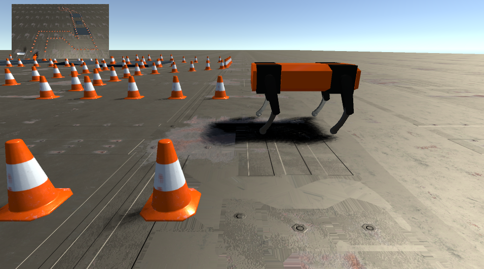

# Legged Robot 🦿🤖




## $`\textcolor{blue}{\text{Attention: Important Remark}}`$ 

The contents of this repository have been tested from scratch on four different computers running Ubuntu 20.04 without any issues. Therefore, following our steps below should not cause any problems. If you encounter any issues, please contact us immediately at jinjun.dong@tum.de. 🍀🤠🎋


## Table of Contents

1. [Important Remark](#attention-important-remark)
2. [Task Description](#task-description)
3. [Getting Started](#getting-started)
   * [Required environments and dependencies](#required-environments-and-dependencies)
   * [Operating Procedures](#step-0-open-a-terminal)
4. [Packages Introduction](#packages-introduction)
5. [Other Functions](#other-functions)
6. [RQT Graph](#rqt-graph)
7. [Documentation](#documentation)
8. [Authors](#authors)


## Task Description

The goal of the project is passing a parkour with your robot in minimal time, while not hitting any of the cones.

The core parts, including but not limited are:

* A Unity simulation environment. A base version will be provided to you.

* A ROS-Simulation-Bridge providing ROS interfaces (topics, services). It will communicate with the simulation via TCP while at the same time providing relevant information to other ROS nodes. A base version will be provided to you. You are free to adjust the code.

* A basic position controller leveraging gait walking.

* A state machine for your robot.

* A perception pipeline that converts the depth image, first to a point cloud and second to a voxel-grid representation of the environment.

* A path planner that generates a path through the environment.

* A trajectory planner that plans a trajectory based on the found path.

It is required that you at least once implement one of the following ROS elements by yourself:

* ROS service - document where you used a ROS service call

* Implement an own message type - document which message you definened by yourself

## Getting Started

### Required environments and dependencies:

* Ubuntu 20.04

* ROS Noetic Ninjemys

* Unity

* Other dependencies that need to be downloaded and installed:


```console
sudo apt-get update

sudo apt-get install ros-noetic-depthimage-to-laserscan

sudo apt-get install ros-noetic-rtabmap-ros

sudo apt-get install ros-noetic-move-base

sudo apt-get install ros-noetic-depth-image-proc

sudo apt-get install ros-noetic-octomap ros-noetic-octomap-msgs ros-noetic-octomap-ros

sudo apt-get install ros-noetic-octomap-server

sudo apt-get install ros-noetic-octomap-rviz-plugins

```


<br/>

Once you have downloaded and installed **all the pkg**, you can now pull all our gitlab remote files into your local repository, and now the moment of magic will happen 🔮, have fun and enjoy!

Please execute the following steps one by one:

#### Step 0: Open a terminal: 
```console
bash s0_catkin_build.bash
```
$`\textcolor{green}{\text{Attention:}}`$ 
   
   Once the `catkin build` command is finished, and then open the folder **00_Unity_legged_robot_initial_files**, copy the files to **.../devel/lib/simulation/**

#### Step 1: Open a new terminal (Ctrl + Alt + T) : 
```console
bash s1_legged_robot_simulation.bash
```
#### Step 2: Open a new terminal (Ctrl + Alt + T) : 
```console
bash s2_slam_mapping.bash
```
#### Step 3: Open a new terminal (Ctrl + Alt + T) : 
```console
bash s3_navigation.bash
```
#### Step 4: Open a new terminal (Ctrl + Alt + T) : 
```console
bash s4_control.bash
```
#### Step 5: Open a new terminal (Ctrl + Alt + T) : 
```console
bash s5_rostopic_echo_cmd_vel.bash
```
#### Step 6: Open a new terminal (Ctrl + Alt + T) : 
```console
bash s6_switch_in_and_out_jump_mode.bash
```
<br/>


If you want to use the {+ new message type that is created by ourselves +}   - **FiveParametersOfTheFourLegs.msg** to view the real-time values of the 5 parameters controlling the 4 legs of the robot dog, you can do the following:


After you have already started the aforementioned 6 bash terminals (1~6), you can open a new terminal (Ctrl + Alt + T):
```console
rostopic list
```

and you will find a topic named **"/my_legged_robot/five_parameters_four_legs_status"**. 
Then, you can run:
```console
rostopic echo /my_legged_robot/five_parameters_four_legs_status
```

and the terminal will respond with the real-time values of the 5 parameters controlling the 4 legs of the robot dog using our own message type -  FiveParametersOfTheFourLegs.msg.

## Packages Introduction

`legged_robot_rtabmap`
* Feeds camera information (RGB camera and depth camera) to RTAB-Map
* Constructs a 2D projection map
* And by publishing the odom coordinate system, it provides real-time localization of the robot's accurate position

* The launch file integrates several necessary components to start: simulation, rtabmap, move_base
* It uses move_base for navigation, achieving path planning and trajectory planning.
* The parameter files needed for move_base are stored in the params folder within the Config folder.

<br/>

`controller_pkg`
* controller_node.cpp subscribes to the /cmd_vel topic published by move_base to receive the message content about the required real-time speed, and converts it into suitable combinations of 5 parameters.

* switch_in_and_out_jump_mode.py allows manual switching into/out of **JUMP** mode when needed.

<br/>

`my_legged_robot_msgs`
* Stores our custom message type: **FiveParametersOfTheFourLegs.msg**


## Other Functions

`teleop_pkg`  <br/>

In the **teleop** and **quan** branches, we have created this auxiliary function for teleoperation.
* teleop_publisher_node.py reads the user's  keyboard input and publishes it to the topic /teleop
* teleop_subscriber_node subscribes to the topic /teleop and perform motion decision based on the user's input. The commands are then published to the topic /commands to move the robot

* The launch file teleop.launch launches both nodes with one single command:

```console
roslaunch teleop_pkg teleop.launch
```

## RQT Graph


## Documentation

We store our documentation (final written reports and the video of project outcomes) in a Google Drive folder. You can click to open, view, and download them in the following links:

* **Final Report**: https://docs.google.com/document/d/1zHIq2PLuyE7osk-6vIE6WIapmTZ-6XciOl30jyWHWds/edit?usp=drive_link

* **Presentation Slides**: https://docs.google.com/presentation/d/12_OfTHpokygqL9W1rPDTf8AksCno3wDC2FlGy2Xn7Ao/edit?usp=sharing

* **Video of Legged Robot(×6)**: https://drive.google.com/file/d/1ZXnwHM7MFsrFwFMi2KMtJ6_MZu02--am/view?usp=drive_link

* **Gantt Chart**: https://docs.google.com/spreadsheets/d/1nmKPpE6cp1iwdo1hl-LOo3sB8z7KLcxG/edit?usp=drive_link&ouid=103277388812761575294&rtpof=true&sd=true

## Authors

* **Gräbner, Theresa**
    * Email Address: [theresa.graebner@tum.de](mailto:theresa.graebner@tum.de)
    * GitLab Account: [@00000000014A5A0A](https://gitlab.lrz.de/00000000014A5A0A)

* **Pham, Quan**
    * Email Address: [quan.pham@tum.de](mailto:quan.pham@tum.de)
    * GitLab Account: [@lagessiehcs](https://gitlab.lrz.de/lagessiehcs)

* **Jiang, Hanchong**
    * Email Address: [hanchong.jiang@tum.de](mailto:hanchong.jiang@tum.de)
    * GitLab Account: [@00000000014A0921](https://gitlab.lrz.de/00000000014A0921)

* **Zhang, Zongwei**
    * Email Address: [zongwei.zhang@tum.de](mailto:zongwei.zhang@tum.de)
    * GitLab Account: [@ge89qah](https://gitlab.lrz.de/ge89qah)

* **Jinjun Dong**
    * Email Address: [ge26hes@mytum.de](mailto:ge26hes@mytum.de)
    * GitLab Account: [@00000000014ADEF1](https://gitlab.lrz.de/00000000014ADEF1)

